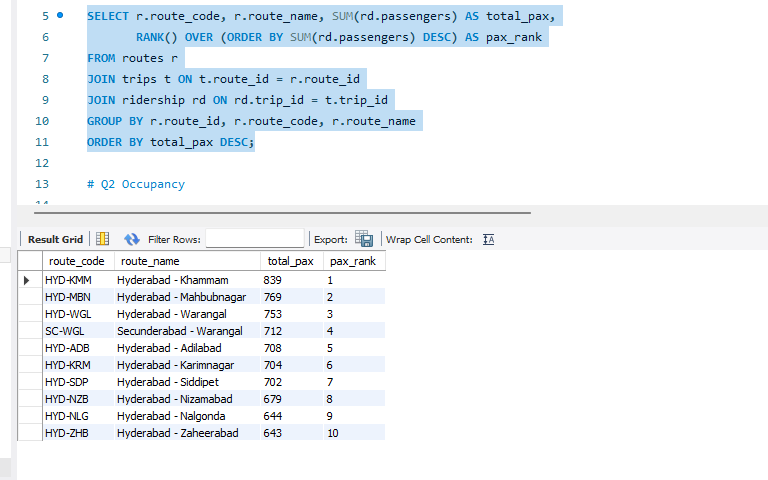
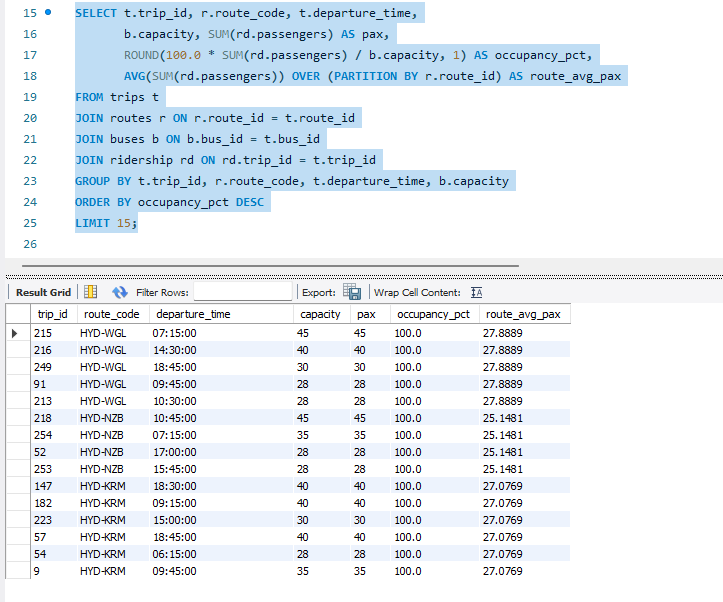
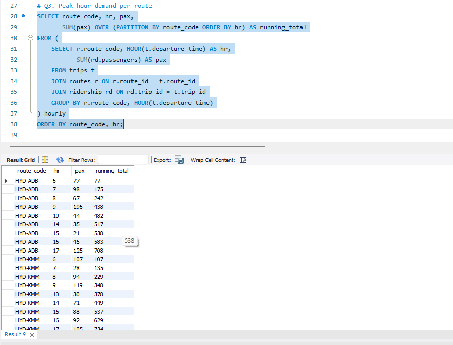
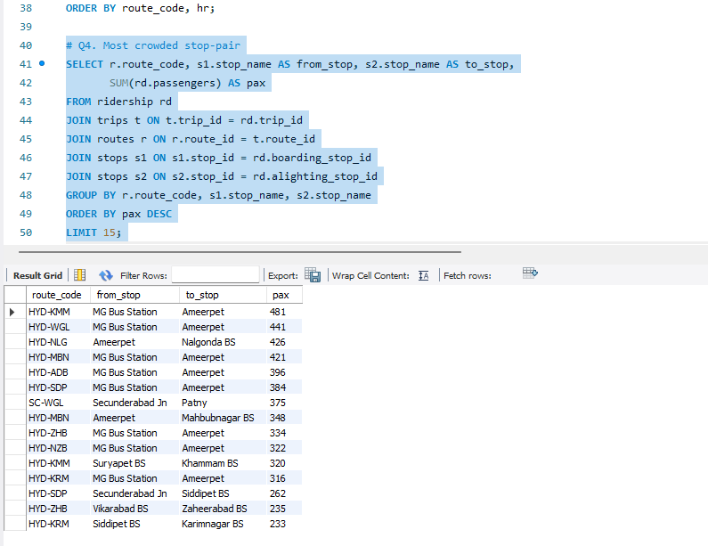

# 🚌 Telangana RTC Bus Route Analytics

SQL-based analysis of bus routes, trips, and ridership patterns across Telangana using window functions.

## 📌 Database Schema
5 normalized tables: `stops`, `routes`, `route_stops`, `buses`, `trips`, `ridership` with proper foreign key relationships.

## 🛠️ Tech Stack
MySQL 8.0+ (Window Functions: RANK, AVG OVER, SUM OVER)

## 📊 Key Analysis Queries
1. **Busiest Route** — Ranks routes by total passenger count using `RANK()`
2. **Occupancy Analysis** — Per-trip occupancy % vs bus capacity, compared to route average
3. **Peak-Hour Demand** — Hourly passenger trends with running total per route
4. **Crowded Stop-Pairs** — Most trafficked boarding-alighting combinations

## 💡 Key Insights
- MG Bus Station → Ameerpet is the busiest stop-pair with 421 passengers

## 📷 Screenshots

## 🔗 Author
Huzef Khan — [GitHub](https://github.com/Huzefkhan1) | [LinkedIn](https://linkedin.com/in/huzef-khan)
