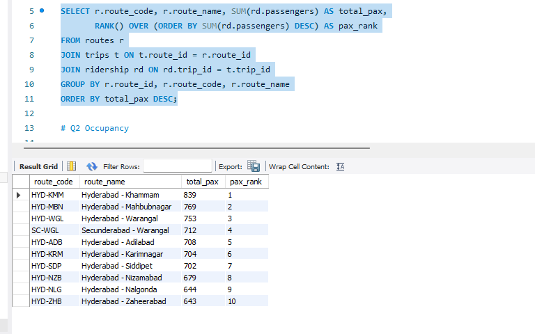
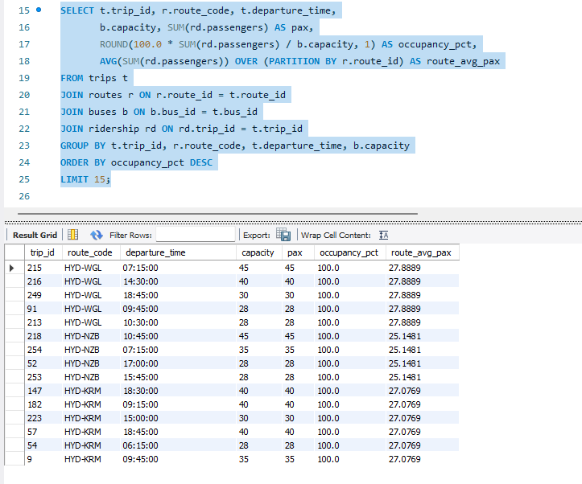
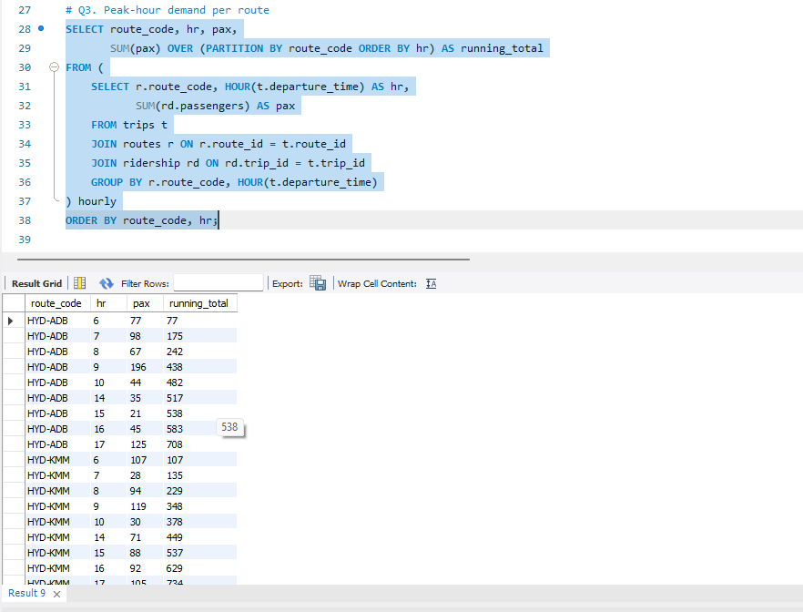
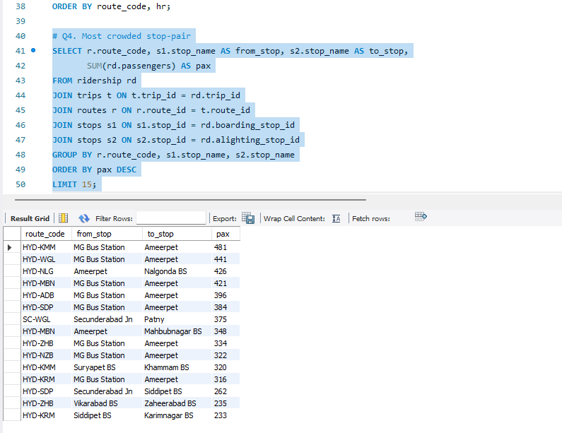

# 🚌 Telangana RTC Bus Route Analytics

SQL-based analysis of bus routes, trips, and ridership patterns across Telangana using window functions.

## 📌 Database Schema

6 normalized tables with proper foreign key relationships:

| Table | Purpose |
|---|---|
| `stops` | Bus stops |
| `routes` | Bus routes |
| `route_stops` | Which stops belong to which route |
| `buses` | Buses and their capacity |
| `trips` | Individual bus trips |
| `ridership` | Passenger boarding and alighting records |

## 🛠️ Tech Stack

- MySQL 8.0+
- Window functions: `RANK()`, `AVG() OVER`, `SUM() OVER`

## 📊 Key Analysis Queries

1. **Busiest Route:** ranks routes by total passenger count using `RANK()`
2. **Occupancy Analysis:** per-trip occupancy % against bus capacity, compared with the route average
3. **Peak-Hour Demand:** hourly passenger trends with a running total per route
4. **Crowded Stop-Pairs:** the most trafficked boarding and alighting combinations

## 💡 Key Insights

- **MG Bus Station → Ameerpet** is the busiest stop-pair, with **421 passengers**.

## ▶️ How to run

1. Open MySQL 8.0 or later (MySQL Workbench works well).
2. Create the tables and load the data.
3. Run the analysis queries one by one.

<!-- Add query output screenshots here:
## 📷 Screenshots

-->

## 🔗 Author

**Huzef Khan** | Aspiring Data Analyst, Hyderabad

- Portfolio: [huzefkhan1.github.io](https://huzefkhan1.github.io)
- GitHub: [Huzefkhan1](https://github.com/Huzefkhan1)
- LinkedIn: [Huzef Khan](https://www.linkedin.com/in/huzef-khan-b1278433b)
- Email: huzefk837@gmail.com
## 📷 Screenshots

## 🔗 Author
Huzef Khan — [GitHub](https://github.com/Huzefkhan1) | [LinkedIn](https://linkedin.com/in/huzef-khan)
